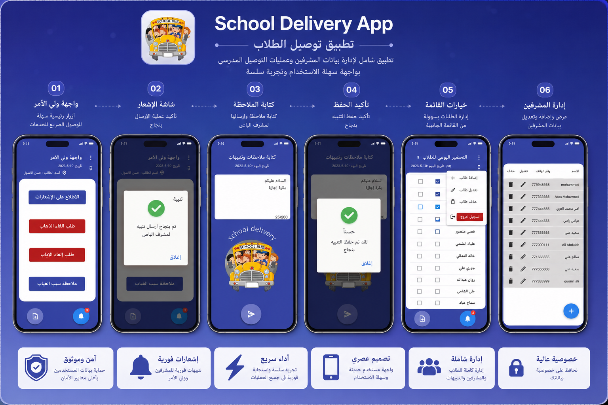
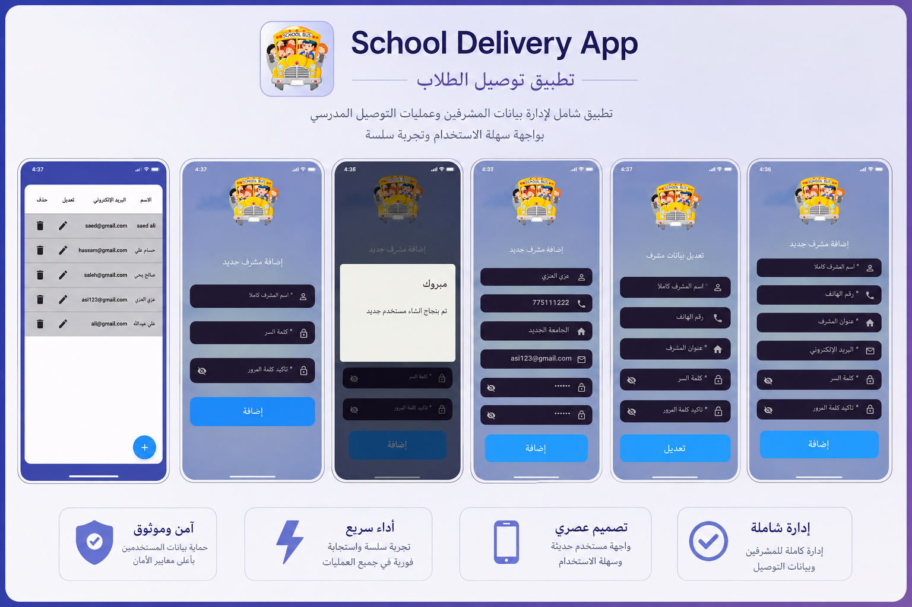
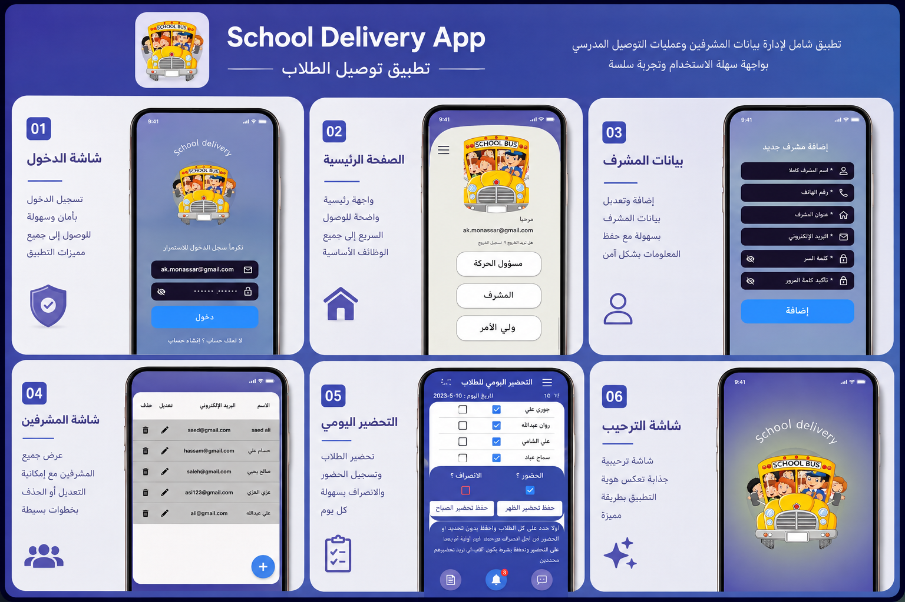

# 📦 Flutter CampusExpress Delivery App (Graduation Project)

A comprehensive, production-ready School Delivery Ecosystem built using **Flutter**, **Dart**, and **Google Firebase**. This advanced multi-screen system features over **33+ responsive user interfaces**, strict input validations, and reactive backend architecture, designed specifically to streamline delivery logistics within educational campuses.

---

### 🎥 Live System Demonstration

Here is a quick **1-minute time-lapse video** showcasing the full system navigation and flow:

[

> 💡 **Want a deep dive with voiceover?** Watch the [Full 29-Minute Technical Video & Firebase Demo on YouTube](https://youtube.com) 🚀

---

### 🛠️ Key Architecture & Features
* **Enterprise-Grade UI:** 33+ beautifully tailored screens optimized for smooth cross-platform performance.
* **Strict Form Validation:** Built-in advanced field check (Regex, character length, empty fields) for secure login, registration, and user data entry.
* **Reactive Firebase Backend:** Fully driven by Firebase Authentication and Firestore to manage fast, real-time logistics data streaming.
* **Complex State Management:** Scalable clean architecture allowing for safe navigation flows and synchronous UI state updates.

---

### 📸 System Architecture & UI Walkthrough

Below is a direct, high-resolution showcase of the application's comprehensive design boards and system walkthroughs:

#### 📱 01. Core App Navigation & Authentication Flow

#### 🔐 02. Supervisor Dashboard & Input Validation

#### ⚙️ 03. Admin Console & Firebase User Management

